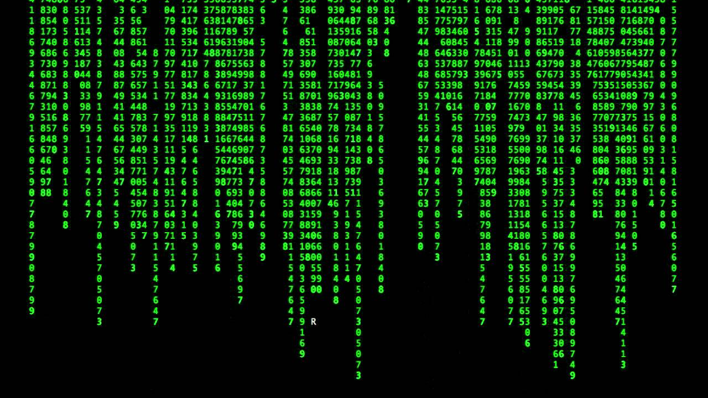

# 
**Помощь при работе с Git**

## *Основные команды*      

*git config --global user.name "Name Lastname"*
указание имени пользователя

*git config --global user. email user@mail.ru*
указание email пользователя

*git --version*
установленная версия Git

*git config --list*
проверка текущих настроек

*git init*
Когда создан проект (папка) и написаны первые строки кода, нужно инициализировать проект. Превращает папку в репозиторий, где Git  начинает отслеживать файлы и их изменения. Делается единожды

*git add help.md*
Перед сохранением созданные файлы и изменения нужно проиндексировать
*git add .* 
Можно использовать эту команду, если создано много файлов или внесено много изменений к ним.

*git commit*
Сохраняет текущее состояние рабочего репозитория

*git commit -m "название коммита"*
Только теперь после индексации файлы можно закоммитить (сохранить)

*git commit -am "название коммита"*
Позволяет одновременно проиндексировать файлы (за которыми ведется слежка) и закоммитить их

*git status*
Показывает состояние файлов в рабочей директории и индексе: какие изменены, но не добавлены в индекс; какие ожидают коммита в индексе. + подсказки, как изменить состояние файлов

*git clean*
Удаляет мусор из рабочей директории. Это могут быть результаты сборки проекта или файлы конфликтов слияний

*git log/git reflog*
Просмотр существующих коммитов. Первая команда покажет пару последних коммитов, а вторая выведет список всех. Чтобы выйти из списка, нажать "Q"

*git log -p*
Позволяет подробно изучить изменения, внесенные в каждый файл

*git checkout*
Переключение между версиями

*git checkout master*
Вернуться из предыдущей версии в последнюю

*git diff*
Просмотр разницы между текущим состоянием и последним коммитом. Или для сравнения других коммитов (для этого через пробел нужно ввести две четверки первых букв имен необходимых коммитов). Перед переключением версии файла в Git использовать git log, чтобы увидеть количество сохранений

*clear* очищает терминал

## **Синтаксис языка Markdown**

    **Жирный текст** - **по обеим сторонам текста, который необходимо выделить

    *Курсивный текст* - *по обеим сторонам текста, который необходимо выделить

    ~Зачеркнутый текст~ - ~по обеим сторонам текста, который необходимо выделить

    Показать уровень заголовка - подчеркивание знаками = или ****

    1, 2, 3... - нумерованные списки обозначаются обычными цифрами

    * Ненумерованные списки обозначаются * в начале строки
        Вложенные списки - выполняем отступы
    
    Вставка изображения
    Загрузить в рабочую папку изображение, проиндексировать и закоммитить его. Скопировать относительеый путь изображения. Ввести 
    

    Переход по ссылке - <путь> 
    <https://use-web.ru/news.php?id=138&tid=3>

    Вставка цитаты 
    >Здесь цитата
    >в которой перед каждой новой строкой
    >ставится угловая скобка
